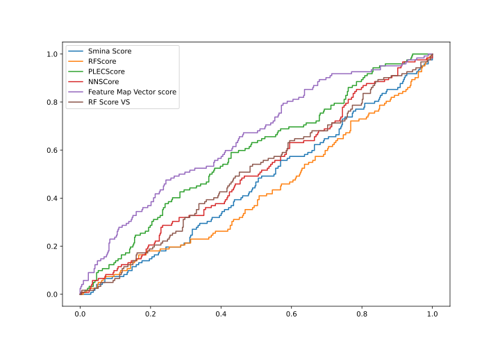
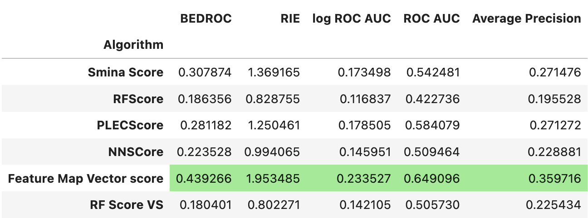
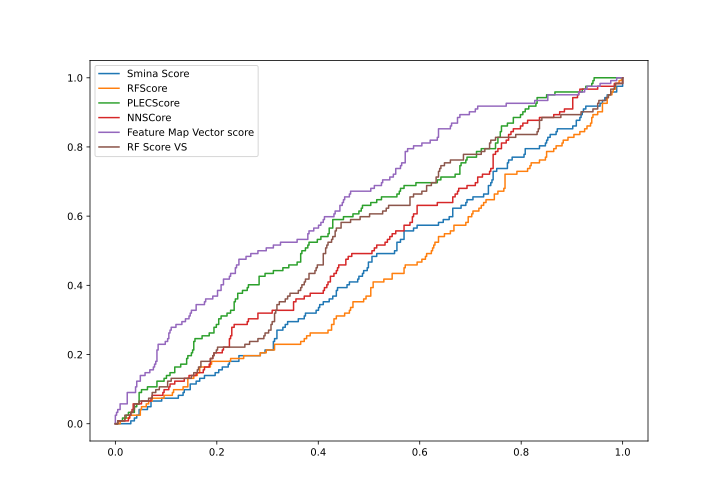
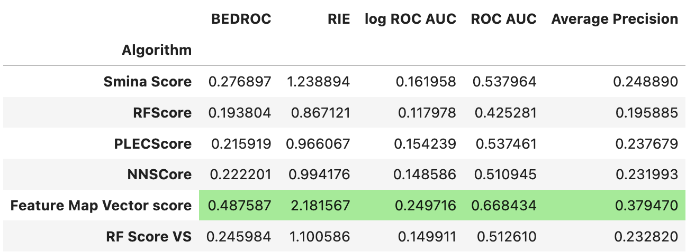

# d4-rescore

##### Table of Contents  
[Intro](#intro)  
[Results](#results)  
[Method](#method)  


<a name="intro"/>
## Intro
In [1], Lyu et al dock Enamine REAL at the D4 receptor. They selected ~550 ligands at random from a range of high- and low-scoring buckets, and test these _in vitro_ at 10µM. This represents a perfect test-case for re-scoring algorithms:
- The actives all bind to the same binding site, and even the same conformation (with reasonably high confidence)
- The inactive labels are experimentally determined
- The actives do not arise from congeneric series and are not based on prior knowledge, as is often the case in ChEMBL
- The setting is a real use-case - i.e. re-ranking docked structures to identify hits
- The receptor is an 'easy' case: a small, enclosed, polar binding site

If re-scoring algorithms can accurately rank the actives before the inactives, they are unambiguously useful for re-scoring. If they do not, it indicates they are either not useful, or may suffer from high false-positive rate (like docking). In the high FPR case, they still may be useful but they just happened to fail on these ligands. 

[1] [Ultra-large library docking for discovering new chemotypes](https://www.nature.com/articles/s41586-019-0917-9)

<a name="results"/>
## results
The tested re-scoring algorithms were:  PLECScore, RFScore, and NNScore (BINANA features), which are available in ODDT, as well as RF-Score-VS-v1. With a nod to the Rognan lab's paper showing re-scoring algorithms are outperformed by scoring similarity to a known ligand, I also tested RDKit's 'feature map vectors', a similarity score between pharmacophoric points.

In short, feature map vectors out-perform any of the re-scoring methods, followed by vanilla Smina score and/or PLECScore, which are slightly better than random depending on what metric you prefer. NNScore, RFScore, and RF-Score-VS, do not appear to recognise actives at a higher rate than inactives. 

ROC:



Early enrichment metrics:




After 'preparing' the ligands, i.e. enumerating tautomers, charge states, and enantiomers, there is little change:

ROC:



Early enrichment metrics:




[2] [True Accuracy of Fast Scoring Functions to Predict High-Throughput Screening Data from Docking Poses: The Simpler the Better](https://pubs.acs.org/doi/abs/10.1021/acs.jcim.1c00292)

<a name="method"/>
## steps to reproduce:

1. read and embed ligands

See `1-read_and_embed_ligands.ipynb`. This step takes the SMILES codes given in the supplementary of Lyu et al and prepares them for docking in two ways: the first is directly embedding each ligand in 3D using RDKit's EKTDG method, the second is enumerating tautomers/charge states/enantiomers with the Durrant lab's Gypsum-DL, which also embeds into 3D.

2. prepare the protein for docking

This workflow uses the script available at https://github.com/ljmartin/pdb_to_pdbqt . The resulting PDB was converted to `.pdbqt` format with `obabel proteinH.pdb -xr -O proteinH.pdbqt`

3. dock!

Docking was run with Smina:
```
cd ./data/
smina -r proteinH.pdbqt -l ligands3d.sdf --autobox_ligand AQD_ligand.pdb -o ligands3d_docked.sdf
smina -r proteinH.pdbqt -l ligands3d_gypsum.sdf --autobox_ligand AQD_ligand.pdb -o ligands3d_gypsum_docked.sdf
```